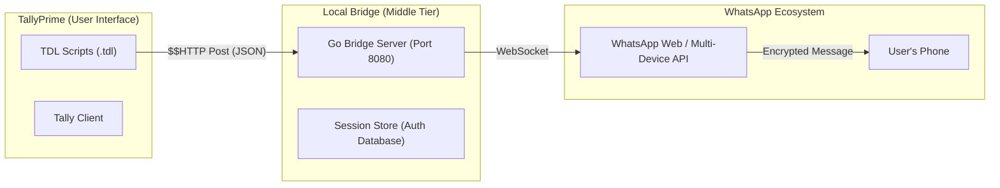

# 🏗️ Tally WhatsApp Integration: Codebase Overview & Guide

This guide provides a deep dive into how the Tally WhatsApp Integration is structured, how the components communicate, and where each piece of logic resides.

---

## 1. High-Level Architecture

The system follows a modern **three-tier architecture** designed for speed, reliability, and headless operation.

### Key Differences from Legacy System:
*   **Old Way:** Tally used a C# DLL (COM) which opened a hidden Chrome window and simulated clicks (Selenium). This was slow and brittle.
*   **New Way:** Tally talks directly to a Go-based service via **HTTP**. The Go service maintains a persistent, headless connection to WhatsApp via the "Whatsmeow" library.

---

## 2. Directory Structure & File Map

### 📂 `whatsapp-mcp/whatsapp-bridge/` (The Server)
The "Bridge" is a standalone background service written in Go.

| File/Folder | Purpose |
| :--- | :--- |
| `main.go` | **Entry Point.** Starts the HTTP server, connects to WhatsApp, and handles the initial QR code scanning. |
| `api/` | **Endpoints.** Contains the logic for `/api/send-message`, `/api/send-file`, and `/api/health`. |
| `validation/` | **Safety.** Checks if files exist on disk and if they are within size limits before trying to send them. |
| `store/` | **Persistence.** Contains the SQLite database that saves your WhatsApp login session so you don't have to scan the QR code every time. |
| `whatsapp-bridge.exe` | The compiled ready-to-run service. |

### 📂 `TallyWhatsappSender/TDL/` (The Tally Frontend)
Tally Definition Language (TDL) scripts that run natively inside TallyPrime.

| File | Purpose |
| :--- | :--- |
| `WhatsAppHTTP.tdl` | **Core Library.** Contains the foundational HTTP functions (`WA_HTTPSendMessage`, `WA_HTTPSendFile`). This is the "API Client" for Tally. |
| `InvoiceSender.tdl` | Adds the **"WhatsApp Invoice"** button (Alt+W) to Sales/Purchase vouchers. |
| `ReceiptSender.tdl` | Adds the **"WhatsApp Receipt"** button to Receipt vouchers. |
| `PaymentReminder.tdl` | Logic for sending text-based payment reminders from the Ledger Outstanding reports. |
| `Configuration.tdl` | Adds the **"WhatsApp Tool" menu** in Tally for health checks and settings. |
| `WhatsappSenderTally.txt`| **Master File.** This is the one you load into Tally; it includes all other TDLs automatically. |

---

## 3. Communication Flow (How it Works)

When you press **Alt+W** on a Sales Invoice, here is exactly what happens:

1.  **TDL Hook:** `InvoiceSender.tdl` detects the button press.
2.  **Export:** Tally saves the current invoice as a PDF to `C:\TallyWhatsApp\TallyWhatsapp\Invoice.pdf`.
3.  **Sanitization:** `WhatsAppHTTP.tdl` cleans the phone number (removes spaces/dashes) and escapes the file path into a JSON-safe format.
4.  **HTTP Request:** Tally executes a `$$HTTP Post` to `http://127.0.0.1:8080/api/send-file`.
    *   *Payload:* `{ "recipient": "919876543210", "file_path": "C:\\TallyWhatsApp\\...", "caption": "Invoice #123" }`
5.  **Bridge Processing:** The Go Bridge receives the JSON, validates that the PDF exists, and uploads it to WhatsApp's servers.
6.  **WhatsApp Delivery:** The Bridge sends the message signal via WebSocket.
7.  **Response:** The Bridge returns a JSON success/error message back to Tally, which displays it in a popup.

---

## 4. Key Connection Points

### The Health Check
The Bridge exposes a `/api/health` endpoint. Before any send operation, Tally calls this to check if:
1.  The bridge is actually running.
2.  The user is logged in (authenticated).
If either fails, Tally shows a helpful warning *before* trying to export or send.

### File Path Handshaking
Because the Bridge and Tally run on the **same computer**, Tally doesn't need to upload the actual file content to the Bridge. Instead, Tally tells the Bridge: *"Look at this specific path on the hard drive,"* and the Bridge reads it directly. This makes sending massive PDFs instantaneous.

---

## 5. Deployment / "What Goes Where"

To set up a new machine:

1.  **Install Directory:** Everything should live in `C:\TallyWhatsApp`.
2.  **Bridge Service:** `whatsapp-bridge.exe` must be running (ideally as a Windows Service using the provided `install.ps1`).
3.  **TDL Loading:** Point Tally to `C:\TallyWhatsApp\TDL\WhatsappSenderTally.txt`.
4.  **Firewall:** Port **8080** must be open for local communication.

---

## 💡 Troubleshooting Reference

*   **Bridge Log:** If messages aren't going, check the terminal window where the Bridge is running. It logs every failed attempt with detailed error codes.
*   **"Failed to Send" in Tally:** Usually means the file path was sent incorrectly (slashes not escaped) or the bridge is not running. 
*   **JSON Errors:** Tally is very picky about quotes. Always use `$$StringFindAndReplace` to escape manual message text entered by users.
